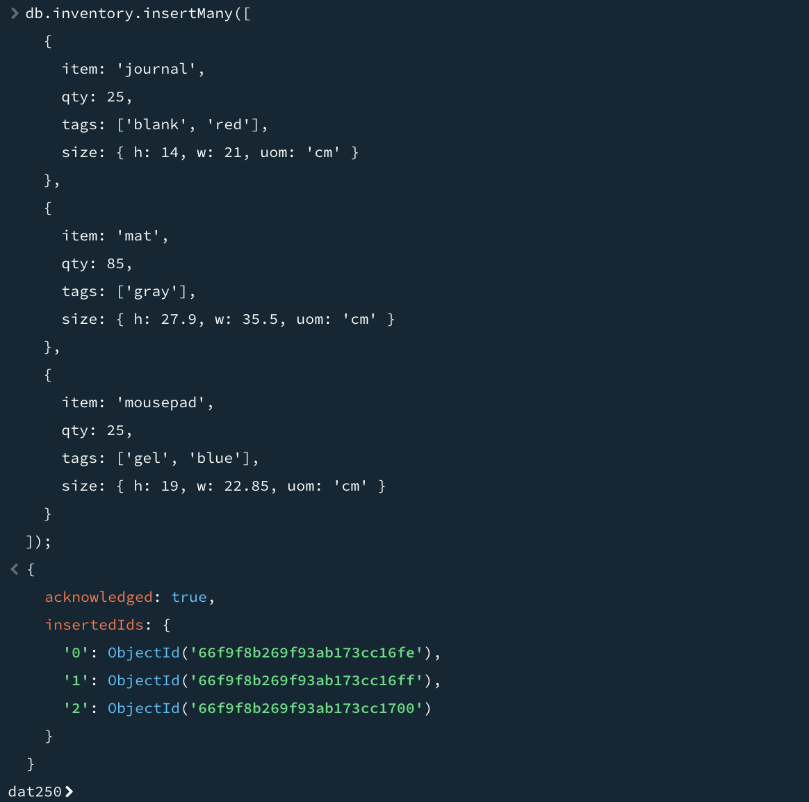
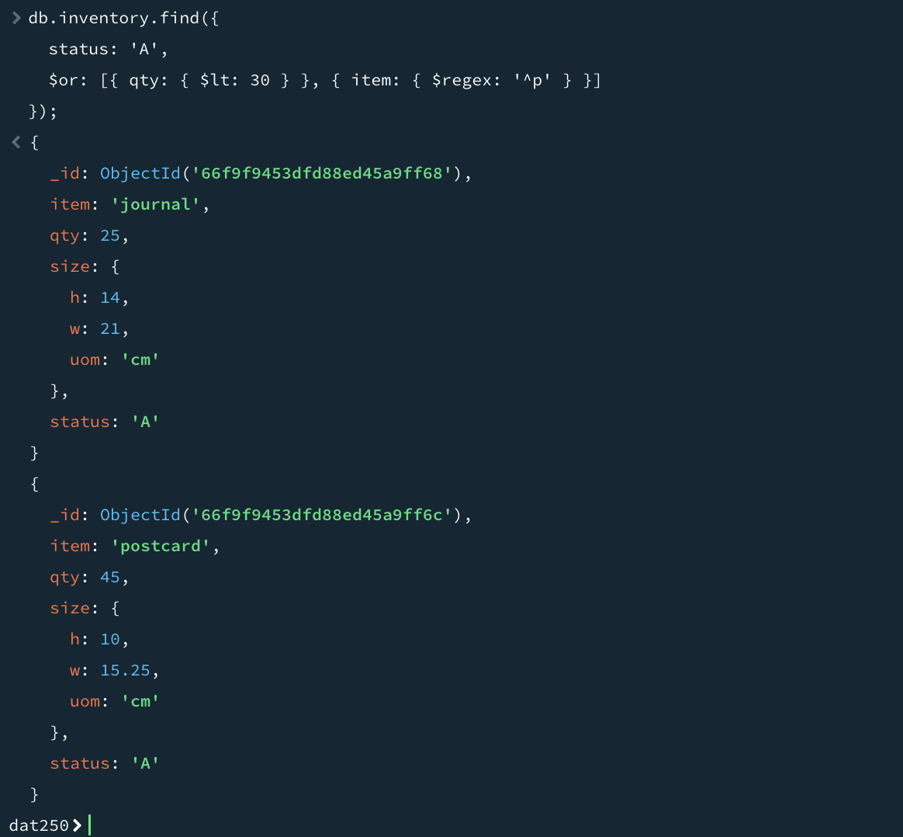
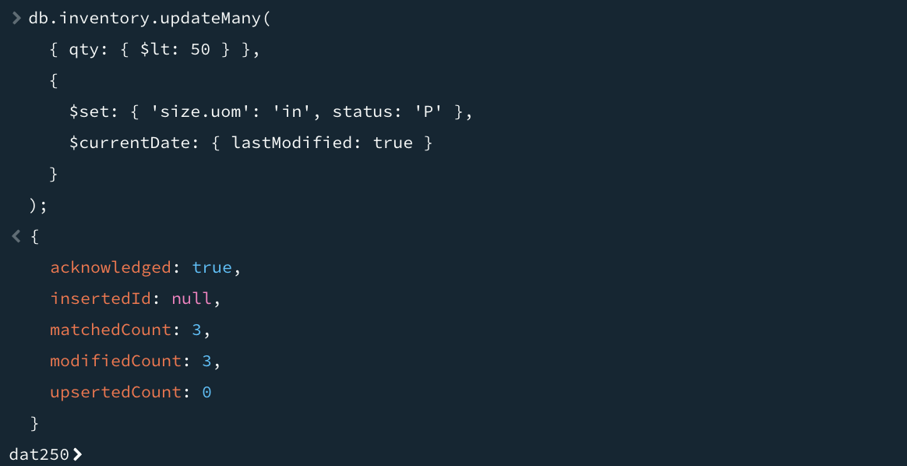
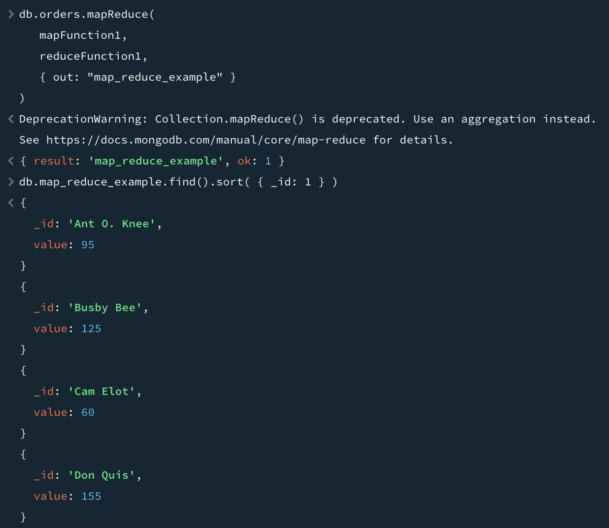
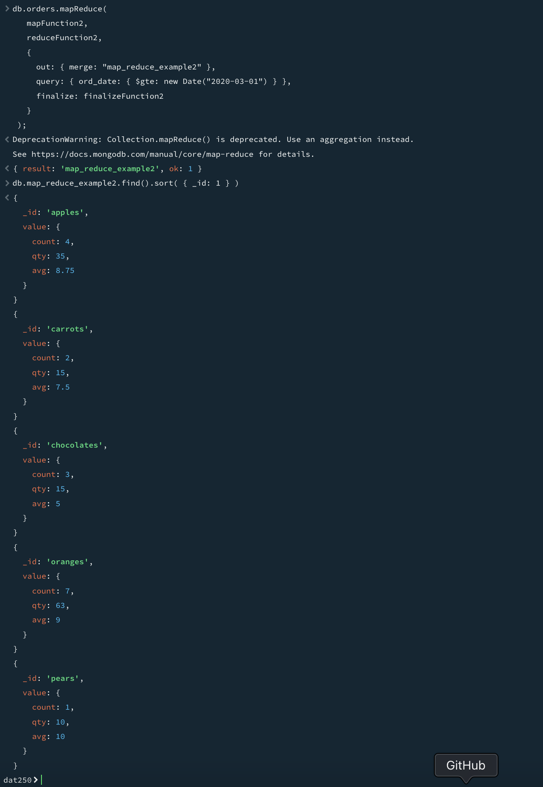

# Experiment 5 - MongoDB

## Installation

I installed MongoDB via Homebrew on macOS.

```sh
brew tap mongodb/brew
brew install mongodb-community
```

In order to verify the installation, I downloaded the signature using this command. Homebrew does verify signatures automatically, but I did it manually against the one it installed for good measure.

```sh
# Download the public key
curl -LO https://pgp.mongodb.com/server-8.0.asc
gpg --import server-8.0.asc

# Download the signature
curl -LO https://fastdl.mongodb.org/osx/mongodb-macos-arm64-8.0.0.tgz.sig
```

I then verified the signature:

```sh
$ gpg --verify mongodb-macos-arm64-8.0.0.tgz.sig ~/Library/Caches/Homebrew/mongodb-community--8.0.0.tgz
gpg: Signature made Thu Sep 12 01:31:32 2024 CEST
gpg:                using RSA key 4B0752C1BCA238C0B4EE14DC41DE058A4E7DCA05
gpg: Good signature from "MongoDB 8.0 Release Signing Key <packaging@mongodb.com>" [unknown]
gpg: WARNING: This key is not certified with a trusted signature!
gpg:          There is no indication that the signature belongs to the owner.
Primary key fingerprint: 4B07 52C1 BCA2 38C0 B4EE  14DC 41DE 058A 4E7D CA05
```

After installing and verifying, I started MongoDB as a background service:

```sh
brew services start mongodb-community
```

I then connected to it using `mongosh`.

## Experiment 1: CRUD

I followed each tutorial, taking screenshots of the execution of the main commands.

Inserting documents:



Querying documents:



Updating documents:



Deleting documents:


Bulk write operations:


## Experiment 2: Aggregation

Result of "Total Price Per Customer":



Result of "Calculate Order and Total Quantity with Average Quantity Per Item":



### Custom query

Finally, I came my own query, which calculates revenue per date, with the top selling product of that date:

```js
db.orders.mapReduce(
  function () {
    emit(this.ord_date, {
      total: this.price,
      items: this.items,
    });
  },
  function (key, values) {
    const total = values.reduce((acc, val) => acc + val.total, 0);

    const revenueByProduct = {};
    for (const value of values) {
      for (const item of value.items) {
        if (!revenueByProduct[item.sku]) {
          revenueByProduct[item.sku] = 0;
        }
        revenueByProduct[item.sku] += item.qty * item.price;
      }
    }

    let topSellingProduct;
    for (const sku in revenueByProduct) {
      if (
        !topSellingProduct ||
        revenueByProduct[sku] > revenueByProduct[topSellingProduct]
      ) {
        topSellingProduct = sku;
      }
    }

    return {
      total,
      revenueByProduct,
      topSellingProduct,
    };
  },
  {
    out: "revenue_per_date_by_product",
  },
);
```

Here are the results:

```js
db.revenue_per_date_by_product.find({});
[
  {
    _id: ISODate("2020-03-18T00:00:00.000Z"),
    value: {
      total: 25,
      revenueByProduct: { oranges: 25 },
      topSellingProduct: "oranges",
    },
  },
  {
    _id: ISODate("2020-03-01T00:00:00.000Z"),
    value: {
      total: 25,
      revenueByProduct: { oranges: 12.5, apples: 12.5 },
      topSellingProduct: "oranges",
    },
  },
  {
    _id: ISODate("2020-03-08T00:00:00.000Z"),
    value: {
      total: 120,
      revenueByProduct: { oranges: 45, pears: 25, chocolates: 50 },
      topSellingProduct: "chocolates",
    },
  },
  {
    _id: ISODate("2020-03-19T00:00:00.000Z"),
    value: {
      total: 85,
      revenueByProduct: { carrots: 10, apples: 25, chocolates: 50 },
      topSellingProduct: "chocolates",
    },
  },
  {
    _id: ISODate("2020-03-23T00:00:00.000Z"),
    value: {
      total: 25,
      revenueByProduct: { oranges: 25 },
      topSellingProduct: "oranges",
    },
  },
  {
    _id: ISODate("2020-03-20T00:00:00.000Z"),
    value: {
      total: 155,
      revenueByProduct: { carrots: 5, apples: 50, oranges: 50, chocolates: 50 },
      topSellingProduct: "apples",
    },
  },
];
```

I think the query is useful in order to monitor revenue development over time, and to see which products are the most popular on a given day. The output collection makes it possible to find an entry for a particular date, and see the total revenue, revenue per product, and the top selling product.
